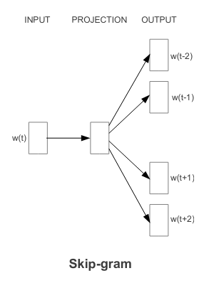
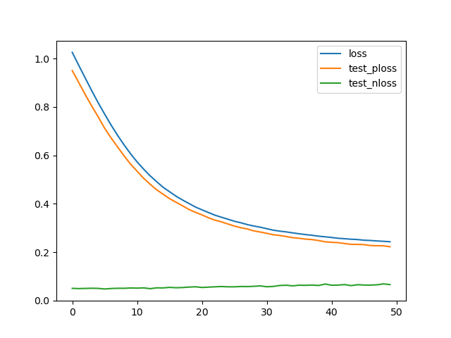
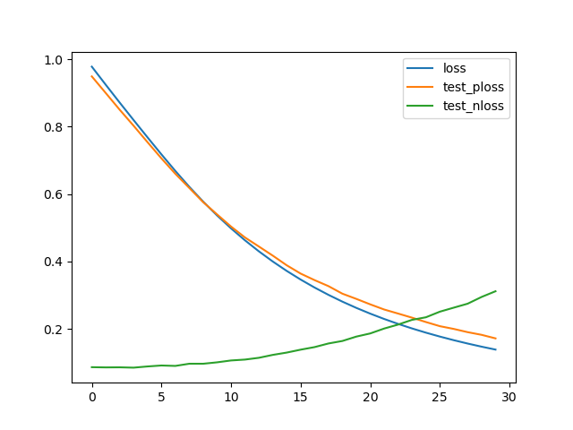
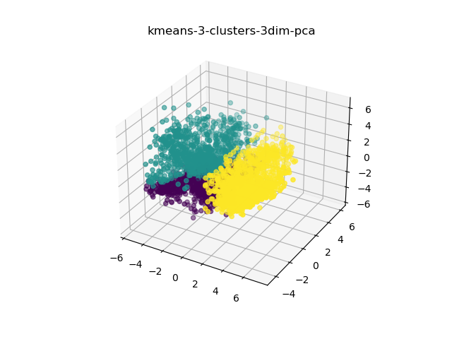
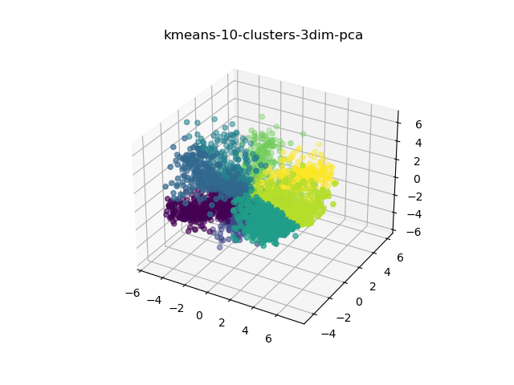
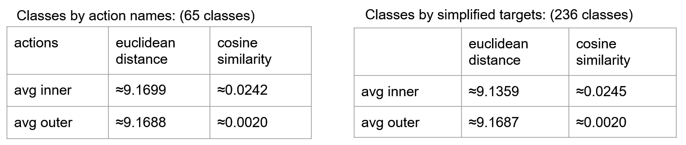

# Action Embeddings (CC-Project SS 21) 


## Installation

Supported python version: 3.9

We recommend using a virtual environment especially to avoid dependency problems. 

Create virutal environment:

```
python -m pip install --user virtualenv

python -m venv env

source env/bin/activate (For Windows: env\Scripts\activate)
```

Install requirements:

```
pip install -r requirements.txt
```

## Motivation

We realised a pipeline for the creation and evaluation of action embeddings. Additionally we assess if arithmetic relations, similar to those present in word embeddings, can be observed. After that we want to evaluate the created embeddings by considering metrics and application in furthermore tasks. Finally we talk about limitations and problems that occur during the development process.


## What are Embeddings? (Till)


Action embeddings are similar to word embeddings. The central motivation behind word embeddings is to represent the contextual relations of words by a multi dimensional vector space. Due to their contextual information embeddings are often used in further specific behavior understanding/generation tasks. The contextual meaning is realised by the arithmetic of the vector space. For example we have the relation capital:

*Capital = France - Paris*

We could now use the relation to gain information.

*Germany + Capital = Berlin*

For word type classificatin, given the surrounding words, we could used them directly as an input for a neuronal Network. Alternatively the words are replaced by the corresponding embeddings and the results get better in many cases.

In a nutshell the embedding vectors are trained by taking sequences from the corpus. For each sequence embeddings of the word in the middle and the surrounding words get customized to be more similar to each other. As a result the whole training process yield embedding vectors which are more similar to each other if the corresponding words occure in the same context. Likewise are action embeddings are created.

## Our corpus/dataset (Lukas)

For training the action embeddings the Virtual Home’s ‘Activity Knowledge Base’ (AKB) (http://virtual-home.org/tools/explore.html) was used. 
The AKB consists of many action sequences which were collected for training robots. 

Each action sequence consists of a series of ordered actions and aims to achieve some sort of goal. 
Additionally, for each sequence there are a title describing the goal, a natural language sentence describing the approach for achieving this goal and a set of conditions which the environment should fulfill in order for the action sequence to be executable. 

In our work we discarded all info except for the action sequences and actions themselves. Each action has a title describing the action, for example “Walk”, “Grab” or “Find”. Optionally actions may also have a list of parameters, or targets, on which the action is performed, for example: “Walk (Table)” for walking to the table or “PutOn (Table, Plate)” for putting a plate on the table. 

Example of an action sequence:

```
Put groceries in Fridge
I put my groceries into the fridge.

[WALK] <food_food> (1)
[GRAB] <food_food> (1)
[FIND] <freezer> (1)
[PUTIN] <food_food> (1) <freezer> (1)
[CLOSE] <freezer> (1)
```

When training the action embeddings we considered two actions to be the same if their titles and parameters are exactly the same.
This means that the order of parameters, which are represented as a list, matters. 
So `[PUTIN] <food_food> (1) <freezer> (1)`  and `[PUTIN] <freezer> (1) <food_food> (1)` are different actions, because the order of parameters has a semantic meaning.
In this case we would consider the second variant, putting a freezer into food, to be nonsensical.

Other approaches which we did not follow could be to discard all parameters, consider them to be a set rather than a list or choose some other metric for deciding if parameters are the same.
 


## Training Process (Augustin)

### Method
The paper [Efficient Estimation of Word Representations in
Vector Space](https://arxiv.org/pdf/1301.3781v3.pdf) made headlines with high quality word embeddings with relatively low computational cost. Many following word embedding approaches build upon that work and we also followed their approach implementing a skipgram architecture with negative sampling: We look at a center token and its surrounding context tokens and maximize the cosine similarity between the center embedding and all context embeddings. Without regularization this might lead to a degenerate solution where every token embedding is the same. That is why we use "negative sampling": We minimize the cosine similarity between the center embedding and randomly sampled embeddings from our dictionary. If the dictionary size is big in relation to the context size we can assume that most random samples are not part of a meaningful context and minimizing their similarity to the center token is useful. This avoids the collapse of the embedding space.



### Training
We choose a embedding dimensionality of 64 and train for 50 epochs with a batchsize of 32 and a context of ±3 tokens, resulting in 32*(3*2)=192 center-to-context-token pairs for the normal *positive* loss (in the graphs called *ploss*). We sample the same amount (192) random negative embeddings and optimize its loss (*nloss*) simultaniously.



The loss decreases steadily while the negative loss stays low which is low from the beginning on since we initialize the embeddings to random vectors, which in a high dimensional space are very unliekly to be correlated. If we remove the negative sampling during training we can see that the positive loss decreases more rapidly but at the same time the negative loss increases indicating a collapse of the embeddings space and providing evidence for the effectiveness of negative sampling:



## Evaluation 

### Clustering
For better visualization we used PCA to reduce the embedding dimensionality to 3 and then clustered the embedding space of all dictionary entries with Kmeans into clusters and then analyzed which tokens are assigned to which cluster: Because each unique action contains an action verb and an action object we caluclated the 10 most frequent action verb and action objects in each cluster. Our results show no obvious structure and meaningful clustering. We suspect that a problem is that the Kmeans method used so far uses eculidean distance for clustering wourso our following work shows that evaluations based on the euclidean distance dont seem to work. Further work can be done by chossing a clustering method which supports cosine similarity.

**Action verb for 3 Clusters:**
0 PutIn, PointAt, PutObjBack, LookAt, TurnTo, Pour, Walk, Grab, Find, PutBack
1 Wipe, Wash, Pour, LookAt, PutObjBack, TurnTo, Walk, Grab, Find, PutBack
2 PointAt, Wipe, Pour, PutObjBack, LookAt, TurnTo, Grab, Walk, Find, PutBack

**Action objects for 10 Clusters:**
0 ['coffe_maker', 'radio', 'food_chicken', 'plate', 'glass', 'sink', 'coffee', 'towel', 'clothes_pants', 'food_food']
1 ['shampoo', 'brush', 'soap', 'food_bread', 'toothbrush', 'mug', 'fryingpan', 'closet', 'rag', 'child']
2 ['document', 'pasta', 'food_food', 'clothes_dress', 'bowl', 'mop', 'television', 'cookingpot', 'cleaning_solution', 'plate']
3 ['mop', 'toilet_paper', 'spoon', 'clothes_pants', 'cup', 'mail', 'hair', 'rag', 'knife', 'kettle']
4 ['toilet', 'plate', 'sink', 'blender', 'chair', 'pillow', 'water', 'toy', 'soap', 'food_bread']
5 ['couch', 'bowl', 'cleaning_solution', 'sponge', 'dish_soap', 'basket_for_clothes', 'soap', 'clothes_dress', 'towel', 'water']
6 ['curtain', 'spoon', 'bowl', 'water', 'hairdryer', 'folder', 'drawing', 'mug', 'bathtub', 'toothbrush']
7 ['document', 'pot', 'toy', 'food_kiwi', 'blanket', 'laptop', 'mouse', 'book', 'juice', 'dish_soap']
8 ['laptop', 'spoon', 'water', 'coffee_cup', 'food_sugar', 'paper', 'cabinet', 'child', 'dish_soap', 'drinking_glass']
9 ['towel', 'knife', 'clothes_shirt', 'book', 'water_glass', 'table_cloth', 'cd_player', 'cookingpot', 'milk', 'clothes_dress']





### Embedding distance and similarities

To check whether the embeddings contain the semantic information we expect it to have through spatial relation, we calculated the similarities between our handcrafted classes and all other embeddings, which do not belong to the distinct class.
We considered two approaches for manually splitting the dataset into classes. First we considered all embeddings which have the same action name as a class.  Around 65 classes are created. 15 are not taken into account, because they are only appearing once.
The second approach puts embeddings in the same class if an embedding contains a target/parameter with the same name. The amount of targets was reduced by always taking the first part of an action target name. e.g. clothes_pants-> clothes. This approach made sense most of the time and reduced the class count to 236. 



These results showed us that there is indeed some sort of clustering happening when using the cosine similarity. But it is not enough to call these groups “clusters”. The euclidean distances show no significant differences. This is what we expected, because it is not a measure in the training.
Start evaluation of distances:

```
python distances.py
```

The computation of the distance matrices takes some time, so it is saved in `result/distance_matrices`.
The four tables containing the results should appear after execution in the following place:

```
results/action_distance_cosine_similiarity.xlsx
results/action_distance_euclidean.xlsx
results/target_distance_cosine_similiarity.xlsx
results/target_distance_euclidean.xlsx
```

### Semantic Analysis and Embedding Arithmetic

Two of the ways we considered for evaluating the semantic properties of the action embeddings was checking for similarity and evaluating embedding arithmetic.

#### Checking for similar vectors

One easy way of checking if word embeddings manage to find meaningful semantic representations is checking which embeddings are most similar to each other and whether the represented actions are similar.
This follows from the initial underlying assumption of these embeddings, which is that actions or words can be semantically defined by the company they keep, i.e. their context.

When choosing some random embeddings and searching for the most similar ones we did find satisfying results, for example:

```
most similar to Walk, ('mirror',) are ["TurnTo, ('mirror',)", "LookAt, ('mirror',)", "Find, ('mirror',)",...]
most similar to Grab, ('box',) are ["Find, ('box',)", "Write, ('box',)", ... ]
```

However some of the results also left much to be desired:

```
most similar to Walk, ('sauce',) are ["Cut, ('food_kiwi',)", "PutBack, ('pot', 'stove')", "PutBack, ('soap', 'paper_towel')",...]
```

#### Embedding Arithmetic
As mentioned earlier, one function of word embeddings is that semantic relationships can be expressed arithmetically.  
Going back to the example of countries and their capitals it can be shown, that the following roughly holds for word embeddings:

```
Germany - Berlin ≈ France - Paris
```

Rearranging the terms gives:
```
Germany - Berlin + Paris ≈ France
```

So one way of checking for this type of relationship is calculating the right hand side, and finding the embedding which is most similar that result.
The most similar embedding in this case would be the one trained for France.

We tried recreating this with our action embeddings:
```
Find (Glass) - Grab(Glass) ≈ Find(Coffee) - Grab(Coffee)
```
And again rearranging as:
```
Find(Glass) - Grab(Glass) + Grab(Coffee) ≈ Find(Coffee)
```

However, when trying to achieve this result, the most similar vector was always `Find(Glass)` again:

```
"Find, ('glass',)" + "Grab, ('coffee',)" - "Grab, ('glass',)" = ["Find, ('glass',)", "Find, ('kitchen_cabinet',)", "Grab, ('glass',)", "Close, ('kitchen_cabinet',)", "Open, ('kitchen_cabinet',)", "Find, ('cupboard',)", "Open, ('cupboard',)", "Walk, ('kitchen_cabinet',)", "Walk, ('cupboard',)", "Close, ('cupboard',)"]
```

We hoped the properties of 'Grab' and 'Glass' would cancel out, leading to "Find, ('coffee',)". 
As discussed in other parts of this document, there might be many reasons for poor or unexpected performance.  

All of these semantic tests can be run by executing the ```semantics.py``` script.

### Prediction


Likewise, word embeddings we want that action embeddings can be used in high level machine-learning tasks. Like in the introduction mentioned, word embeddings are used as an input for next word or word type classification. As an equivalent we made-up the task of unparameterized action prediction. This task is defined by predicting the unparameterized action given the embeddings of the surrounding actions of a sequence. For example, we have this action sequence:

[WALK] <food_food>, [GRAB] <food_food>, [FIND] <freezer>, [PUTIN] <food_food> <freezer> , [CLOSE] <freezer>

The model would receive the embeddings of the actions [WALK] <food_food> (1), [GRAB] <food_food> (1), [PUTIN] <food_food> (1) <freezer> (1), [CLOSE] <freezer> (1) and should predict the unparameterized action [FIND]. 

Start prediction

```
python prediction.py
```

If you want to change the hyperparameters you can edit the variables at module level.

We used the whole corpus to create embedding sequences and unparameterized action as prediction target. The training and evaluation was maded with a randomized test/train split of 0.80/0.20%, batch size of 64, 10 epochs and a learning rate of 0.005.

The architecture consists of three layers. An LSTM, Batch Normalization and Linear Layer. A LSTM Layer is a recurrent layer which receives an timestep sequence (here embedding sequence) and learns during the train process the relations between the time step by including a hidden state into the processing of each timestamp. As a result, it's possible to learn the relation of the timesteps among themselves. The hidden state of the last timestamp is normalized by the batch normalization layer to avoid overfitting to high frequent classes. After that the final dense layer maps the normalized hidden state to the number of classes.

The results are not that good. We achieved an accuracy of 60% in the train and 40% in the test set. A reason for that could be that the network architecture is not suitable or that the train process of the embeddings is more focused on the parameters instead of the unparameterized action. Another possible reason could be that the corpus is to small to learn embeddings or high level tasks based on that.
